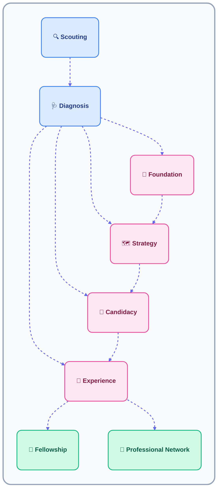

# ⚙️ Nasıl Çalışıyoruz

Career Academy bir ilke etrafında kurulmuştur — mentorluk **kişisel, yapılandırılmış ve ölçülebilir** olmalıdır.  
Her menti, büyümeyi görünür ve sürdürülebilir kılan net sistemlerle desteklenen bire bir rehberlik alır.

---

##  Operasyonel Modelimiz

Programımızın kalbinde **Mentorluk Grubu** yer alır — bir vaka çalışanı ile bir menti arasındaki istikrarlı bire bir ilişki.  
Bu grup, mentorluğun ve büyümenin merkezi birimi olarak hareket eder ve yapı, esneklik ve insan bağlantısını birleştirir.

Her Mentorluk Grubu şunları içerir:
- **Vaka Çalışanı** – yolculuğu yönlendirir, izler ve kişiselleştirir.  
- **Menti** – aktif olarak katılır, yansıtır ve ilerlemeyi takip eder.  
- **Profesyonellere Erişim** – vaka çalışanı aracılığıyla erişilebilir dış mentorlar.  
- **Platform ve Araçlar** – tutarlılık için dijital kontrol listeleri, loglar ve kaynaklar.

###  Çekirdeğimiz: Mentorluk Grupları

Her mentorluk bir **Mentorluk Grubu** ile başlar — tek bir vaka çalışanı ve tek bir menti tarafından paylaşılan özel bir işbirliği alanı.  
Planlama, büyüme ve iletişimin hepsinin tek bir birleşik ortamda gerçekleştiği yerdir.

Bir Mentorluk Grubu şunları içerir:
- Hem menti hem de vaka çalışanının ilerlemeyi takip ettiği paylaşılan bir **çalışma alanı**.  
- Her oturumu ölçülebilir kılan **kontrol listeleri ve loglar**.  
- Mentinin gelişimine göre özelleştirilmiş **kaynak bağlantıları ve materyaller**.  
- Vaka çalışanı tarafından koordine edilen **profesyonel oturumlara erişim**.  

Bu grup hem bir **ilişki** hem de bir **süreç konteyneri** olarak hizmet eder:
- İlişki yön ve güven verir.  
- Süreç konteyneri yapı ve süreklilik sağlar.

> Bir menti. Bir vaka çalışanı. Bir alan — ilerlemede hizalı.

---

###  Keşif

Potansiyel mentileri erişim, referanslar ve ortaklıklar aracılığıyla belirler ve davet ederiz.  
Bu aşama, yapılandırılmış desteğe ihtiyaç duyan ancak henüz yön veya mentorluğa erişimi olmayan bireyleri keşfetmeye odaklanır.

###  Tanı

Her yeni menti, bir vaka çalışanıyla bir **tanı toplantısı** ile başlar.  
Bu, hedeflerini, aşamalarını ve hazırlıklarını belirlemeye yardımcı olur ve onları doğru mentorluk yoluna atamamıza olanak tanır.  
Tanı, hiçbir mentinin yanlış yere yerleştirilmediğinden emin olur — rehberlik her zaman anlayıştan başlar.

---

---

##  Yolculuk Yolları

Tanıdan sonra, her menti hazırlıklarına ve hedeflerine bağlı olarak dört **gelişim yolundan** birine yerleştirilir.  
Bu yollar, alacakları mentorluğun stilini ve derinliğini tanımlar.

| Yol | Menti Profili | Vaka Çalışanı Odak Noktası |
|----------|----------------|------------------|
| **Foundation** | Kararsız, dil veya özgüven engelleriyle karşılaşan. | Netlik, özgüven ve motivasyon oluştur. |
| **Strategy** | Hedefleri var ancak yapı veya yön eksikliği olan. | Kariyer ve eğitim planlarını haritalandır. |
| **Candidacy** | Üniversite veya iş piyasasına hazırlanan. | Hazırlığı ve profesyonel zihniyeti güçlendir. |
| **Experience** | Zaten yükseköğretimde veya çalışan. | Uygulamalı deneyim ve mentorluk derinliği kazan. |

> Her yol özelleştirilmiş destek sunar — mentileri oldukları yerde karşılar, olmalarını beklediğimiz yerde değil.

---

## Kontrol Listeleri: Yollarla Hizalanmış Yapı

Her menti bir veya daha fazla **yol** izler ve her yolun kendine özgü bir kontrol listesi vardır.  
Bu, vaka çalışanlarının her zaman *mentinin hangi aşamada olduğunu* ve *sonraki adımların en çok etki yaratacağını* bilmesini sağlar.

| Kontrol Listesi / Yol | Kullanım Alanı | Açıklama |
|----------------------|-----------|-------------|
| **Foundation Yolu** | Rutinler, istikrar ve akademik tutarlılık | Uyku, çalışma alışkanlıkları, planlama, stres yönetimi ve temel yaşam yapısını kapsar. Mentilerin ilerleme için gerekli temelleri oluşturmasına yardımcı olur. |
| **Strategy Yolu** | Planlama ve yön | Mentileri hedef belirleme, kariyer haritalama, seçenekleri keşfetme, gizli fırsatları belirleme ve uzun vadeli yön oluşturma konusunda yönlendirir. |
| **Experience Yolu** | Gerçek kanıt oluşturma | Gönüllülük, yarı zamanlı iş, kulüp katılımı, sertifikalar, beceri geliştirme ve proje deneyimini takip eder. Mentilerin "genç profesyoneller" haline gelmesine yardımcı olur. |
| **Candidacy Yolu** | İş ve staj hazırlığı | Özgeçmiş, LinkedIn, ön yazılar, referanslar, mülakat pratiği, iş başvuruları ve portföy hazırlığını kapsar. İş piyasasına giren öğrencileri destekler. |

> Her kontrol listesi karışıklığı giderir ve ilerlemeyi tekrarlanabilir kılar.  
> Yollar esnek kalır — ancak yapı önemli hiçbir şeyin kaçırılmadığından emin olur.
---

###  Bursiyerlik

Yollarını tamamladıktan sonra, mentiler **Bursiyerlik Aşamasına** geçerler — liderlik, katkı ve topluluk odaklı bir aşama.  
Bu, bugünün mentilerinin yarının rehberleri haline geldiği sürekli bir öğrenme ekosistemi oluşturur.

Bursiyerler:
- Yeni mentilere destek olur  
- Akran öğrenme veya yansıma oturumlarını birlikte kolaylaştırır  
- Liderlik becerileri geliştirirken hafif rehberlik almaya devam eder  

---

##  Profesyonellere Erişim

Vaka çalışanları, mentiler ile **Profesyonel Ağımız** arasında köprü görevi görür.  
Platform aracılığıyla, mentiler profesyonellerle bire bir veya küçük grup oturumları rezerve edebilir:

- Sektör içgörüleri  
- Portföy ve özgeçmiş geri bildirimi  
- Ağ kurma konuşmaları  
- Kariyer veya akademik yön konusunda rehberlik  

> Her profesyonel görüşme vaka çalışanından geçer — yapı, saygı ve net hedefler sağlar.

###  Profesyonel Ağımız

**Profesyonel Ağımız**, farklı alanlardan aktif mentorları içerir ve mentilerin ilerlemesi sırasında onlara destek olmak için gönüllü olurlar.  
Yapılandırılmış öğrenmenin gerçek dünyaya bağlandığı mentorluk yolculuğunun son katmanını temsil ederler.

Profesyoneller:
- Planlanmış soru-cevap oturumlarına veya mentorluk görüşmelerine katılır  
- Gerçek deneyime dayalı rehberlik ve geri bildirim sunar  
- Mentilerin özgüven ve profesyonel okuryazarlık oluşturmasına yardımcı olur  

> Bu işbirliği eğitimi, mentorluğu ve kariyer fırsatını birbirine bağlar.

---

## Temel Etkinlik Türleri

Her mentorluk, **temel etkinlik türleri** etrafında inşa edilmiş öngörülebilir bir ritim izler.  
Bu ritim, mentilere ilerleme hissi verir ve vaka çalışanlarının birden fazla mentorluğu verimli bir şekilde yönetmesine yardımcı olur.

| Etkinlik Türü | Açıklama | Sıklık | Çıktı |
|-------------|--------------|------------|---------|
| **Alım Oturumu** | Geçmiş, hedefler ve yol haritasını tanımla. | Bir kez | Alım kontrol listesi tamamlandı |
| **Mentorluk Oturumu** | İlerleme ve geri bildirime odaklanan yönlendirilmiş toplantılar. | Haftalık / İki haftada bir | Oturum logu |
| **Yansıma İncelemesi** | Büyümeyi ve yeniden hizalamayı değerlendir. | Aylık | Yansıma logu |
| **Mezuniyet Oturumu** | Başarıları ve sonraki adımları gözden geçir. | Döngü sonu | Mezuniyet özeti |
| **Profesyonel Görüşme** | Profesyonel bir mentorla bağlantı kur. | Gerektiğinde | Ağ kurma notları |

> Bu etkinlikler ritim ve tutarlılık sağlar — mentorluk öngörülebilir, sürdürülebilir ve şeffaf hale gelir.

---

##  Log Sistemi

**Log Sistemimiz**, her mentorluğun şeffaf ve ölçülebilir kalmasını sağlar.  
Hem menti hem de vaka çalışanı aktif olarak güncellemeleri kaydeder ve büyümenin paylaşılan bir zaman çizelgesi oluşturur.

| Rol | Ne Kaydeder | Amaç |
|------|----------------|----------|
| **Menti** | Yansımalar, ilerleme ve tamamlanan hedefler. | Sahipliği ve öz farkındalığı oluşturur. |
| **Vaka Çalışanı** | Oturum özetleri, katılım ve takipler. | Sürekliliği takip eder ve destek ihtiyaçlarını belirler. |

Loglar, mentorluğun hafta hafta nasıl geliştiğini gösteren birleşik bir kayıt oluşturur.  
Ayrıca organizasyonun özel detayları açığa çıkarmadan program genelindeki sonuçları ölçmesine yardımcı olur.

> İki ses, bir paylaşılan kayıt — mentinin büyümesi ve vaka çalışanının rehberliği birleşti.

---

##  Özet

- Her mentorluk bir **Çekirdek Mentorluk Grubu** (1 menti + 1 vaka çalışanı) olarak başlar.  
- Kontrol listeleri, loglar ve etkinlik türleri yapı ve hesap verebilirlik oluşturur.  
- **Yolculuk Yolları** mentilerin aşama-uygun destek almasını sağlar.  
- **Log Sistemi** ilerlemeyi görünür ve izlenebilir tutar.  
- **Bursiyerlik** ve **Profesyonel Ağlar** öğrenmeyi liderlik ve gerçek dünya deneyimiyle bağlar.  

> **İnsan ilişkileri + yapılandırılmış sistemler = ölçülebilir büyüme.**

