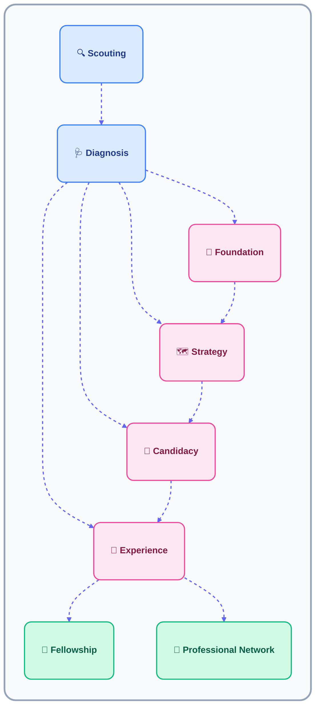

# Career Academy Nedir?

Career Academy, 18–35 yaş arası gençleri bire bir ve sürekli takip yoluyla desteklemek için tasarlanmış,
yapılandırılmış bir kariyer gelişim sistemidir.

Sistem, **Mentee eşleştirme modeli** ile çalışır ve checklist’ler, loglar,
kaynaklar ve profesyonel danışmanlık desteğiyle desteklenir.

Career Academy:

- Motivasyonla sınırlı değildir
- İlerlemeyi zaman içinde takip eder
- Gelişimi, uygulama ve icra üzerinden ölçer
- Sürecin her adımını dokümante eder
- Kişilere bağlı değil, sistem olarak çalışır

# Temel Yapı: Mentorluk Grupları

Her mentorluk süreci bir **Mentorluk Grubu** ile başlar.
Bu grup, tek bir vaka sorumlusu ile tek bir mentee arasında paylaşılan özel bir çalışma alanıdır.

Planlama, gelişim ve iletişimin tamamı bu alan üzerinden yürütülür.

## Mentorluk Grubu İçeriği

- Mentee ve vaka sorumlusunun birlikte ilerlemeyi takip ettiği ortak bir çalışma alanı
- Her görüşmeyi ölçülebilir kılan checklist’ler ve loglar
- Mentee’nin gelişimine özel kaynak bağlantıları ve materyaller
- Vaka sorumlusu tarafından koordine edilen profesyonel görüşmelere erişim

## Yapısal Rol

Bu grup hem bir ilişkiyi hem de bir süreci temsil eder:

- **İlişki:** Yön, güven ve sorumluluk sağlar
- **Süreç:** Yapı, süreklilik ve devamlılık sağlar

> Bir mentee. Bir vaka sorumlusu. Tek bir alan — ilerleme odağında.

# Gelişim Yolları

Tanılama sonrasında her mentee, hazır oluş seviyesine ve hedeflerine göre
dört gelişim yolundan birine yerleştirilir.

Bu yollar, alınacak mentorluk yaklaşımını ve derinliğini belirler.

| Yol | Mentee Profili | Vaka Sorumlusu Odağı |
|----|---------------|---------------------|
| Foundation | Kararsız, dil veya özgüven bariyerleri olan | Netlik, özgüven ve temel motivasyon |
| Strategy | Hedefi var ama yapı eksik | Kariyer ve eğitim planlaması |
| Candidacy | Üniversite veya iş piyasasına hazırlanıyor | Profesyonel hazır oluş |
| Experience | Eğitimde veya çalışıyor | Uygulamalı deneyim ve mentorluk derinliği |

> Amaç, mentee’yi bulunduğu noktadan ileri taşımaktır — beklenen noktaya zorlamak değil.