```mermaid
flowchart LR
  subgraph box[" "]
    A["🔍 <b>Scouting</b>"]
    B["🩺 <b>Diagnosis</b>"]
    
    C["🌱 <b>Foundation</b>"]
    D["🗺️ <b>Strategy</b>"]
    E["🎯 <b>Candidacy</b>"]
    
    F["🚀 <b>Experience</b>"]
    
    G["🌟 <b>Fellowship</b>"]
    H["💼 <b>Professional Network</b>"]
    
    A --> B
    B --> C
    B --> D
    B --> E
    B --> F
    C --> D
    D --> E
    E --> F
    
    F --> G
    F --> H
  end
  
classDef stageClass fill:#dbeafe,stroke:#3b82f6,stroke-width:2px,color:#1e3a8a,padding:25px,rx:12,ry:12
  classDef pathClass fill:#fce7f3,stroke:#ec4899,stroke-width:2px,color:#831843,padding:25px,rx:12,ry:12
  classDef finalClass fill:#d1fae5,stroke:#10b981,stroke-width:2px,color:#065f46,padding:25px,rx:12,ry:12
  classDef boxClass fill:#f8fafc,stroke:#94a3b8,stroke-width:3px,rx:20,ry:20,padding:40px
  
  linkStyle default stroke:#6366f1,stroke-width:2px,stroke-dasharray:5 5
  
  class A,B stageClass
  class C,D,E,F pathClass
  class G,H finalClass
  class box boxClass
```

# Career Academy Nedir?

Career Academy, 18–35 yaş arası gençleri bire bir ve sürekli takip yoluyla desteklemek için tasarlanmış,
yapılandırılmış bir kariyer gelişim sistemidir.

Sistem, **Mentee eşleştirme modeli** ile çalışır ve checklist’ler, loglar,
kaynaklar ve profesyonel danışmanlık desteğiyle desteklenir.

Career Academy:

- Motivasyonla sınırlı değildir
- İlerlemeyi zaman içinde takip eder
- Gelişimi, uygulama ve icra üzerinden ölçer
- Sürecin her adımını dokümante eder
- Kişilere bağlı değil, sistem olarak çalışır

# Temel Yapı: Mentorluk Grupları

Her mentorluk süreci bir **Mentorluk Grubu** ile başlar.
Bu grup, tek bir vaka sorumlusu ile tek bir mentee arasında paylaşılan özel bir çalışma alanıdır.

Planlama, gelişim ve iletişimin tamamı bu alan üzerinden yürütülür.

## Mentorluk Grubu İçeriği

- Mentee ve vaka sorumlusunun birlikte ilerlemeyi takip ettiği ortak bir çalışma alanı
- Her görüşmeyi ölçülebilir kılan checklist’ler ve loglar
- Mentee’nin gelişimine özel kaynak bağlantıları ve materyaller
- Vaka sorumlusu tarafından koordine edilen profesyonel görüşmelere erişim

## Yapısal Rol

Bu grup hem bir ilişkiyi hem de bir süreci temsil eder:

- **İlişki:** Yön, güven ve sorumluluk sağlar
- **Süreç:** Yapı, süreklilik ve devamlılık sağlar

> Bir mentee. Bir vaka sorumlusu. Tek bir alan — ilerleme odağında.

# Gelişim Yolları

Tanılama sonrasında her mentee, hazır oluş seviyesine ve hedeflerine göre
dört gelişim yolundan birine yerleştirilir.

Bu yollar, alınacak mentorluk yaklaşımını ve derinliğini belirler.

| Yol | Mentee Profili | Vaka Sorumlusu Odağı |
|----|---------------|---------------------|
| Foundation | Kararsız, dil veya özgüven bariyerleri olan | Netlik, özgüven ve temel motivasyon |
| Strategy | Hedefi var ama yapı eksik | Kariyer ve eğitim planlaması |
| Candidacy | Üniversite veya iş piyasasına hazırlanıyor | Profesyonel hazır oluş |
| Experience | Eğitimde veya çalışıyor | Uygulamalı deneyim ve mentorluk derinliği |

> Amaç, mentee’yi bulunduğu noktadan ileri taşımaktır — beklenen noktaya zorlamak değil.