```mermaid
graph LR
    A["📊 BASELINE PERIOD<br/>━━━━━━━━━━━━━━<br/>2017-2019 Average<br/><br/><b>10.9%</b><br/><br/>Reference Point"]
    B["📈 FIRST MEASUREMENT<br/>━━━━━━━━━━━━━━<br/>June 2024<br/><br/><b>13.5%</b><br/><br/>+2.6pp increase"]
    C["📉 LATEST DATA<br/>━━━━━━━━━━━━━━<br/>June 2025<br/><br/><b>14.2%</b><br/><br/>+3.3pp cumulative"]
    
    A -->|"+2.6pp"| B
    B -->|"+0.7pp"| C
    
    style A fill:#10b981,stroke:#059669,stroke-width:4px,color:#fff
    style B fill:#f59e0b,stroke:#d97706,stroke-width:4px,color:#fff
    style C fill:#ef4444,stroke:#dc2626,stroke-width:4px,color:#fff
```

# Survey Findings (2025)

This page summarizes what **recent Canadian surveys** say about students and young people, and how those findings shape our programs.

Right now, we mainly rely on **external national and campus-level surveys**. Our work is to translate this reality into practical support through:

- Career Academy  
- Hidden Gems  
- Synergy Meetups  
- Mentee Resources & Templates  

We do **not** claim these are our own internal numbers. They describe the environment our students live in.

---

## 1. Snapshot: Key Pressures on Students & Youth

### Key Metrics (External Surveys)

| Theme                 | Metric (Canada)                                                                 | Year / Source                                |
|-----------------------|----------------------------------------------------------------------------------|----------------------------------------------|
| Financial stress      | 92% of post-secondary students stressed about money                             | TD student survey 2025 :contentReference[oaicite:0]{index=0} |
| Mental health         | 75% of post-secondary students struggle with their mental health                | Universities Canada summary :contentReference[oaicite:1]{index=1} |
| New mental challenges | 61% developed **new** mental health challenges since the pandemic               | CASA/MHCC survey :contentReference[oaicite:2]{index=2} |
| Campus MH users       | 95% of students using campus mental health services feel overwhelmed/exhausted  | National survey (Moghimi et al., 2023) :contentReference[oaicite:3]{index=3} |
| Youth unemployment    | ~14–15% unemployment for ages 15–24 (multi-year high in 2024–2025)              | StatCan & federal briefing notes :contentReference[oaicite:4]{index=4} |
| Returning students    | 17.9% unemployment for returning students (15–24) in summer 2025                | StatCan Labour Force Survey, Aug 2025 :contentReference[oaicite:5]{index=5} |
| NEET youth            | 914,000 youth (15–29) not in employment, education or training (11.5%)          | ESDC NEET briefing 2025 :contentReference[oaicite:6]{index=6} |
| GenAI preparedness    | 68% of PSE students say their education **hasn’t prepared** them to use GenAI at work | HEQCO survey 2024 :contentReference[oaicite:7]{index=7} |

These numbers define the **baseline reality** for our mentees.

---

## 2. Financial Stress: Almost Everyone Is Struggling

A 2025 TD survey of Canadian post-secondary students found:

- **92%** of students are stressed about their finances  
- This is higher than the **65%** financial stress rate in the general population :contentReference[oaicite:8]{index=8}  

```mermaid
graph TB
    subgraph FS["&nbsp;&nbsp;&nbsp;💰 FINANCIAL STRESS ANALYSIS&nbsp;&nbsp;&nbsp;&nbsp;&nbsp;&nbsp;Canada, TD 2025&nbsp;&nbsp;&nbsp;"]
        direction LR
        A1["&nbsp;<br/>&nbsp;&nbsp;&nbsp;📊 STUDENTS&nbsp;&nbsp;&nbsp;<br/>&nbsp;<br/>&nbsp;&nbsp;&nbsp;<b>92%</b>&nbsp;&nbsp;&nbsp;<br/>&nbsp;<br/>&nbsp;&nbsp;&nbsp;Stressed About Money&nbsp;&nbsp;&nbsp;<br/>&nbsp;"]
        A2["&nbsp;<br/>&nbsp;&nbsp;&nbsp;📊 GENERAL POPULATION&nbsp;&nbsp;&nbsp;<br/>&nbsp;<br/>&nbsp;&nbsp;&nbsp;<b>65%</b>&nbsp;&nbsp;&nbsp;<br/>&nbsp;<br/>&nbsp;&nbsp;&nbsp;Stressed About Money&nbsp;&nbsp;&nbsp;<br/>&nbsp;"]
        A3["&nbsp;<br/>&nbsp;&nbsp;&nbsp;📈 GAP ANALYSIS&nbsp;&nbsp;&nbsp;<br/>&nbsp;<br/>&nbsp;&nbsp;&nbsp;<b>+27 points</b>&nbsp;&nbsp;&nbsp;<br/>&nbsp;<br/>&nbsp;&nbsp;&nbsp;41% Higher in Students&nbsp;&nbsp;&nbsp;<br/>&nbsp;"]
        
        A1 -.->|"&nbsp;&nbsp;Compare&nbsp;&nbsp;"| A3
        A2 -.->|"&nbsp;&nbsp;Compare&nbsp;&nbsp;"| A3
    end
    
subgraph MH["&nbsp; &nbsp; &nbsp; &nbsp;🧠 MENTAL HEALTH INDICATORS&nbsp;&nbsp;&nbsp;&nbsp;&nbsp;&nbsp;Selected Canadian Surveys&nbsp;&nbsp;&nbsp;<br/>&nbsp;<br/><br/>&nbsp;"]
    direction LR
    B1["&nbsp;<br/>&nbsp;&nbsp;&nbsp;💭 MENTAL HEALTH STRUGGLES&nbsp;&nbsp;&nbsp;<br/>&nbsp;<br/>&nbsp;&nbsp;&nbsp;<b>75%</b>&nbsp;&nbsp;&nbsp;<br/>&nbsp;<br/>&nbsp;&nbsp;&nbsp;3 in 4 Canadians&nbsp;&nbsp;&nbsp;<br/>&nbsp;"]
    B2["&nbsp;<br/>&nbsp;&nbsp;&nbsp;🦠 POST-PANDEMIC IMPACT&nbsp;&nbsp;&nbsp;<br/>&nbsp;<br/>&nbsp;&nbsp;&nbsp;<b>61%</b>&nbsp;&nbsp;&nbsp;<br/>&nbsp;<br/>&nbsp;&nbsp;&nbsp;New Challenges Emerged&nbsp;&nbsp;&nbsp;<br/>&nbsp;"]
    B3["&nbsp;<br/>&nbsp;&nbsp;&nbsp;⚠️ SEVERE CASES&nbsp;&nbsp;&nbsp;<br/>&nbsp;<br/>&nbsp;&nbsp;&nbsp;<b>32%</b>&nbsp;&nbsp;&nbsp;<br/>&nbsp;<br/>&nbsp;&nbsp;&nbsp;Poor/Very Poor Rating&nbsp;&nbsp;&nbsp;<br/>&nbsp;"]
    
    B1 -->|"&nbsp;&nbsp;Leads to&nbsp;&nbsp;"| B2
    B2 -->|"&nbsp;&nbsp;Results in&nbsp;&nbsp;"| B3
end
    
    FS ==>|"&nbsp;&nbsp;&nbsp;&nbsp;Strong Correlation Observed&nbsp;&nbsp;&nbsp;&nbsp;"| MH
    
    style A1 fill:#fee2e2,stroke:#dc2626,stroke-width:3px,color:#1f2937,rx:15,ry:15
    style A2 fill:#dbeafe,stroke:#2563eb,stroke-width:3px,color:#1f2937,rx:15,ry:15
    style A3 fill:#fef3c7,stroke:#d97706,stroke-width:3px,color:#1f2937,rx:15,ry:15
    style B1 fill:#ede9fe,stroke:#7c3aed,stroke-width:3px,color:#1f2937,rx:15,ry:15
    style B2 fill:#fef3c7,stroke:#d97706,stroke-width:3px,color:#1f2937,rx:15,ry:15
    style B3 fill:#fee2e2,stroke:#dc2626,stroke-width:3px,color:#1f2937,rx:15,ry:15
    style FS fill:#f9fafb,stroke:#6366f1,stroke-width:3px,color:#1f2937,rx:12,ry:12
    style MH fill:#f9fafb,stroke:#6366f1,stroke-width:3px,color:#1f2937,rx:12,ry:12
```

  
  

---

## 3. Youth Employment: A Structurally Difficult Market

These unemployment trends show a clear structural shift in the youth labour market. Even as overall employment in Canada has stabilized, young people — especially students and recent graduates — continue to face elevated unemployment rates. This means the job market challenges students feel are not personal failures but structural realities.

For our work, this means:

- We recognize that **students are entering one of the toughest youth job markets in recent years**.
- Job-search strategies must be based on **direction, strategy, and long-term preparation**, not pressure or unrealistic timelines.
- We highlight high-demand, stable pathways such as teaching, public service, community roles, emergency services, trades, and certain health fields.
- Peer-based environments like **Synergy Meetups** help students share opportunities, reduce isolation, and see real pathways forward.
- Candidacy-building (skills, resume, experience, projects) becomes a **multi-month plan**, not a last-minute scramble.

---

## 4. GenAI Skills: High Usage, Low Preparedness

Major Canadian surveys show a growing disconnect between how much students use AI tools and how prepared they feel to apply them in real workplaces. While adoption is rising quickly, confidence and formal training are not keeping pace.

Key takeaways for our work:

- Students rely on AI tools for schoolwork, but many feel **uncertain about ethical use, workplace expectations, and skill alignment**.
- Programs like Career Academy emphasize **practical, responsible AI use**, especially within job applications and everyday productivity.
- We integrate simple, accessible guidance into our templates and casework — from writing resumes with support tools to understanding how AI fits different career fields.

---

## 5. Underuse of Campus Resources

National and campus-level surveys consistently show that while university services are helpful, many students either:

- Don’t know what’s available  
- Feel intimidated or unsure how to start  
- Only seek help in their final semesters  

For our mentees, this means:

- A major part of our work is **navigation** — helping students find and actually use the resources they already have.
- Our role is not to replace campus services but to **bridge the gap** between students and their schools’ support systems.
- Caseworkers help mentees understand what to expect when visiting:
  - Career centres  
  - Writing centres  
  - Academic advising  
  - Accessibility and learning skills services  

This dramatically increases student engagement and follow-through.

---

## 6. How These Findings Shape Our Programs

Across all surveys, the message is consistent: students are facing overlapping pressures — financial, academic, mental health, job market uncertainty, and technological shifts.

Our programs are designed to respond to these realities:

- **Career Academy:** Long-term planning, candidacy building, routines, and realistic pathways.
- **Hidden Gems:** Alternative and stable career routes often overlooked by students.
- **Synergy Meetups:** Peer environments that make career exploration social, supportive, and less overwhelming.
- **Mentee Resources:** Practical templates, checklists, and guides tied directly to the challenges students face.
- **Casework:** Non-judgmental, structured, predictable support for students navigating complex circumstances.

---

## 7. Next Steps

Over time, we plan to:

- Conduct our own small-scale surveys  
- Compare our mentee population with national trends  
- Refine our programs using real data  
- Build internal dashboards to identify needs earlier  

For now, these external findings give us a **clear, data-backed foundation** for understanding and serving the students we work with.
