```mermaid
flowchart LR
  subgraph box[" "]
    A["🔍 <b>Scouting</b>"]
    B["🩺 <b>Diagnosis</b>"]
    
    C["🌱 <b>Foundation</b>"]
    D["🗺️ <b>Strategy</b>"]
    E["🎯 <b>Candidacy</b>"]
    
    F["🚀 <b>Experience</b>"]
    
    G["🌟 <b>Fellowship</b>"]
    H["💼 <b>Professional Network</b>"]
    
    A --> B
    B --> C
    B --> D
    B --> E
    B --> F
    C --> D
    D --> E
    E --> F
    
    F --> G
    F --> H
  end
  
classDef stageClass fill:#dbeafe,stroke:#3b82f6,stroke-width:2px,color:#1e3a8a,padding:25px,rx:12,ry:12
  classDef pathClass fill:#fce7f3,stroke:#ec4899,stroke-width:2px,color:#831843,padding:25px,rx:12,ry:12
  classDef finalClass fill:#d1fae5,stroke:#10b981,stroke-width:2px,color:#065f46,padding:25px,rx:12,ry:12
  classDef boxClass fill:#f8fafc,stroke:#94a3b8,stroke-width:3px,rx:20,ry:20,padding:40px
  
  linkStyle default stroke:#6366f1,stroke-width:2px,stroke-dasharray:5 5
  
  class A,B stageClass
  class C,D,E,F pathClass
  class G,H finalClass
  class box boxClass
```

# What Is Career Academy?

Career Academy is a structured career development system designed to support young people aged 18–35 through continuous one-on-one follow-up.

It operates through a **Caseworker–Mentee matching model**, supported by checklists, logs, resources, and professional advisory input.

Career Academy:

- Is not limited to motivation
- Tracks progress over time
- Measures development through execution
- Documents every step of the process
- Operates as a system, not as a person-dependent initiative

Career Academy is a structured career development system designed to support young people aged 18–35 through continuous one-on-one follow-up.

###  Our Core: Mentorship Groups

Every mentorship begins with a **Mentorship Group** — a private collaboration space shared by a single caseworker and a single mentee.

It’s where planning, growth, and communication all happen in one unified environment.

A Mentorship Group includes:
- A shared **workspace** where both mentee and caseworker track progress.  
- **Checklists and logs** that make each session measurable.  
- **Resource links and materials** tailored to the mentee’s development.  
- **Access to professional sessions**, coordinated by the caseworker.  

This group serves as both a **relationship** and a **process container**:
- The relationship gives direction and trust.  
- The process container gives structure and continuity.

> One mentee. One caseworker. One space — aligned on progress.

---

---

##  Journey Pathways

After diagnosis, each mentee is placed in one of four **development pathways** depending on their readiness and goals.  
These pathways define the style and depth of mentorship they’ll receive.

| Pathway | Mentee Profile | Caseworker Focus |
|----------|----------------|------------------|
| **Foundation** | Undecided, facing language or confidence barriers. | Build clarity, confidence, and motivation. |
| **Strategy** | Has goals but needs structure or direction. | Map out career and education plans. |
| **Candidacy** | Preparing for university or job market. | Strengthen readiness and professional mindset. |
| **Experience** | Already in post-secondary or work. | Gain applied experience and mentorship depth. |

> Each pathway offers tailored support — meeting mentees where they are, not where we expect them to be.

---

## Checklists: Structure Aligned With Pathways

Every mentee follows one or more **pathways**, and each pathway has its own dedicated checklist.  
This ensures that caseworkers always know *what stage the mentee is in* and *what steps make the most impact next*.

| Checklist / Pathway | Used For | Description |
|----------------------|-----------|-------------|
| **Foundation Pathway** | Routines, stability, and academic consistency | Covers sleep, study habits, scheduling, stress management, and basic life structure. Helps mentees build the foundations required for progress. |
| **Strategy Pathway** | Planning and direction | Guides mentees through goal-setting, career mapping, exploring options, identifying hidden opportunities, and building long-term direction. |
| **Experience Pathway** | Building real evidence | Tracks volunteering, part-time work, club involvement, certifications, skills-building, and project experience. Helps mentees grow into "young professionals." |
| **Candidacy Pathway** | Job and internship readiness | Covers resume, LinkedIn, cover letters, references, interview practice, job applications, and portfolio preparation. Supports students entering the job market. |

> Each checklist removes confusion and makes progress repeatable.  
> Pathways stay flexible — but the structure ensures nothing important is missed.
---

###  Fellowship

Upon completing their pathway, mentees transition into the **Fellowship Stage**, where they contribute back as peer mentors and share their experiences.  
This creates a continuous learning ecosystem where today’s mentees become tomorrow’s guides.

Fellows:
- Support newer mentees  
- Co-facilitate discussions and workshops  
- Continue receiving light guidance while developing leadership skills  

---

##  Access to Professionals

Caseworkers serve as the bridge between mentees and our **Professional Network**.  
Through the platform, mentees can book one-on-one or small-group sessions with professionals for:

- Industry insights  
- Portfolio and resume feedback  
- Networking conversations  
- Guidance on career or academic direction  

> Every professional call goes through the caseworker — ensuring structure, respect, and clear objectives.

###  Our Professional Network

Our **Professional Network** includes active mentors from different fields who volunteer to support mentees as they progress.  
They represent the final layer of the mentorship journey — where structured learning connects to the real world.

Professionals:
- Participate in scheduled Q&A sessions or mentorship calls  
- Offer guidance and feedback based on real experience  
- Help mentees build confidence and professional literacy  

> This collaboration connects education, mentorship, and career opportunity.

---

##  Summary

- Every mentorship starts as a **Core Mentorship Group** (1 mentee + 1 caseworker).  
- Checklists, logs, and event types create structure and accountability.  
- The **Journey Pathways** ensure mentees receive stage-appropriate support.  
- The **Log System** keeps progress visible and traceable.  
- **Fellowship** and **Professional Networks** connect learning with leadership and real-world experience.  

> **Human relationships + structured systems = measurable growth.**

