```mermaid
flowchart LR
  subgraph box[" "]
    A["🔍 <b>Scouting</b>"]
    B["🩺 <b>Diagnosis</b>"]
    
    C["🌱 <b>Foundation</b>"]
    D["🗺️ <b>Strategy</b>"]
    E["🎯 <b>Candidacy</b>"]
    
    F["🚀 <b>Experience</b>"]
    
    G["🌟 <b>Fellowship</b>"]
    H["💼 <b>Professional Network</b>"]
    
    A --> B
    B --> C
    B --> D
    B --> E
    B --> F
    C --> D
    D --> E
    E --> F
    
    F --> G
    F --> H
  end
  
classDef stageClass fill:#dbeafe,stroke:#3b82f6,stroke-width:2px,color:#1e3a8a,padding:25px,rx:12,ry:12
  classDef pathClass fill:#fce7f3,stroke:#ec4899,stroke-width:2px,color:#831843,padding:25px,rx:12,ry:12
  classDef finalClass fill:#d1fae5,stroke:#10b981,stroke-width:2px,color:#065f46,padding:25px,rx:12,ry:12
  classDef boxClass fill:#f8fafc,stroke:#94a3b8,stroke-width:3px,rx:20,ry:20,padding:40px
  
  linkStyle default stroke:#6366f1,stroke-width:2px,stroke-dasharray:5 5
  
  class A,B stageClass
  class C,D,E,F pathClass
  class G,H finalClass
  class box boxClass
```

# ⚙️ How We Work

Career Academy is built around one principle — mentorship should be **personal, structured, and measurable**.  
Every mentee receives one-on-one guidance, supported by clear systems that make growth visible and sustainable.

---

##  Our Operational Model

At the heart of our program lies the **Core Mentorship Group (CMG)** — a stable one-on-one relationship between a caseworker and a mentee.  
This group acts as the central unit of mentorship and growth, combining structure, flexibility, and human connection.

Each CMG includes:
- **Caseworker** – guides, monitors, and personalizes the journey.  
- **Mentee** – actively participates, reflects, and tracks progress.  
- **Access to Professionals** – external mentors available through the caseworker.  
- **Platform Tools** – digital checklists, logs, and resources for consistency.

> The Core Mentorship Group keeps mentorship human while enabling structure, accountability, and measurable outcomes.

###  Our Core: Mentorship Groups

Every mentorship begins with a **Mentorship Group** — a private collaboration space shared by a single caseworker and a single mentee.  
It’s where planning, growth, and communication all happen in one unified environment.

A Mentorship Group includes:
- A shared **workspace** where both mentee and caseworker track progress.  
- **Checklists and logs** that make each session measurable.  
- **Resource links and materials** tailored to the mentee’s development.  
- **Access to professional sessions**, coordinated by the caseworker.  

This group serves as both a **relationship** and a **process container**:
- The relationship gives direction and trust.  
- The process container gives structure and continuity.

> One mentee. One caseworker. One space — aligned on progress.

---

###  Scouting

We identify and invite potential mentees through outreach, referrals, and partnerships.  
This phase focuses on discovering individuals who need structured support but might not yet have direction or access to mentorship.

###  Diagnosis

Each new mentee begins with a **diagnostic meeting** with a caseworker.  
This helps identify their goals, stage, and readiness, allowing us to assign them to the right mentorship pathway.  
Diagnosis ensures that no mentee is misplaced — guidance always starts from understanding.

---

---

##  Checklists: Structure Made Simple

To reduce complexity and make caseworkers’ tasks easier, we use **predefined checklists** for every stage of the mentorship process.  
Checklists ensure that all important steps are covered while allowing caseworkers to personalize items based on the mentee’s needs.

| Checklist Type | Used For | Description |
|----------------|-----------|--------------|
| **Intake** | Onboarding | Captures goals, background, and expectations. |
| **Session** | Weekly meetings | Tracks progress, discussions, and next steps. |
| **Reflection** | Midpoint reviews | Encourages mentees to assess learning and motivation. |
| **Graduation** | Completion | Summarizes outcomes and future plans. |
| **Follow-Up** | Alumni stage | Keeps the connection alive after the program. |

> Checklists bring order without rigidity — they make progress repeatable, visible, and scalable.

---

##  Journey Pathways

After diagnosis, each mentee is placed in one of four **development pathways** depending on their readiness and goals.  
These pathways define the style and depth of mentorship they’ll receive.

| Pathway | Mentee Profile | Caseworker Focus |
|----------|----------------|------------------|
| **Foundation** | Undecided, facing language or confidence barriers. | Build clarity, confidence, and motivation. |
| **Strategy** | Has goals but needs structure or direction. | Map out career and education plans. |
| **Candidacy** | Preparing for university or job market. | Strengthen readiness and professional mindset. |
| **Experience** | Already in post-secondary or work. | Gain applied experience and mentorship depth. |

> Each pathway offers tailored support — meeting mentees where they are, not where we expect them to be.

---

###  Fellowship

Upon completing their pathway, mentees transition into the **Fellowship Stage**, where they contribute back as peer mentors and share their experiences.  
This creates a continuous learning ecosystem where today’s mentees become tomorrow’s guides.

Fellows:
- Support newer mentees  
- Co-facilitate discussions and workshops  
- Continue receiving light guidance while developing leadership skills  

---

##  Access to Professionals

Caseworkers serve as the bridge between mentees and our **Professional Network**.  
Through the platform, mentees can book one-on-one or small-group sessions with professionals for:

- Industry insights  
- Portfolio and resume feedback  
- Networking conversations  
- Guidance on career or academic direction  

> Every professional call goes through the caseworker — ensuring structure, respect, and clear objectives.

###  Our Professional Network

Our **Professional Network** includes active mentors from different fields who volunteer to support mentees as they progress.  
They represent the final layer of the mentorship journey — where structured learning connects to the real world.

Professionals:
- Participate in scheduled Q&A sessions or mentorship calls  
- Offer guidance and feedback based on real experience  
- Help mentees build confidence and professional literacy  

> This collaboration connects education, mentorship, and career opportunity.

---

## Core Event Types

Every mentorship follows a predictable rhythm built around **core event types**.  
This rhythm gives mentees a sense of progress and helps caseworkers manage multiple mentorships efficiently.

| Event Type | Description | Frequency | Output |
|-------------|--------------|------------|---------|
| **Intake Session** | Define background, goals, and roadmap. | Once | Intake checklist completed |
| **Mentorship Session** | Guided meetings focused on progress and feedback. | Weekly / Bi-weekly | Session log |
| **Reflection Review** | Evaluate growth and realignment. | Monthly | Reflection log |
| **Graduation Session** | Review achievements and next steps. | End of cycle | Graduation summary |
| **Professional Call** | Connect with a professional mentor. | As needed | Networking notes |

> These events provide rhythm and consistency — mentorship becomes predictable, sustainable, and transparent.

---

##  The Log System

Our **Log System** ensures that every mentorship remains transparent and measurable.  
Both the mentee and the caseworker actively record updates, forming a shared timeline of growth.

| Role | What They Log | Purpose |
|------|----------------|----------|
| **Mentee** | Reflections, progress, and completed goals. | Builds ownership and self-awareness. |
| **Caseworker** | Session summaries, engagement, and follow-ups. | Tracks continuity and identifies support needs. |

Logs create a unified record that shows how mentorship evolves week by week.  
They also help the organization measure program-wide outcomes without revealing private details.

> Two voices, one shared record — the mentee’s growth and the caseworker’s guidance combined.

---

##  Summary

- Every mentorship starts as a **Core Mentorship Group** (1 mentee + 1 caseworker).  
- Checklists, logs, and event types create structure and accountability.  
- The **Journey Pathways** ensure mentees receive stage-appropriate support.  
- The **Log System** keeps progress visible and traceable.  
- **Fellowship** and **Professional Networks** connect learning with leadership and real-world experience.  

> **Human relationships + structured systems = measurable growth.**

